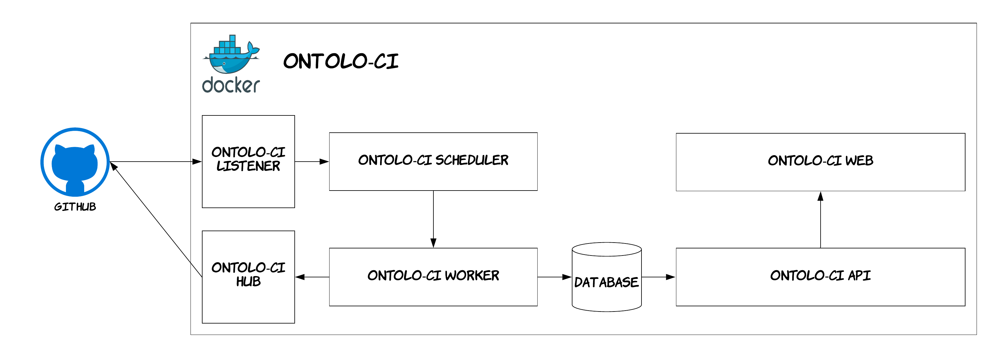

| Entregable     | Sistema de integración continua para ontologías              |
| -------------- | ------------------------------------------------------------ |
| Fecha          | 16/02/2021                                                   |
| Proyecto       | [ASIO](https://www.um.es/web/hercules/proyectos/asio) (Arquitectura Semántica e Infraestructura Ontológica) en el marco de la iniciativa [Hércules](https://www.um.es/web/hercules/) para la Semántica de Datos de Investigación de Universidades que forma parte de [CRUE-TIC](https://www.crue.org/proyecto/hercules/) |
| Módulo         | Control efectivo de versiones de ontologías                  |
| Tipo           | Software                                                     |
| Objetivo       | Sistema encargado de ejecutar la integración continua de ontologías a través de shape expressions sobre Git[Hub] Flow |
| Estado         | **100%** Todos los casos de usos de este sistema han sido implementados, así como la documentación asociada. |

## HerculesCRUE's fork of onotolo-ci

This is HerculesCRUE's fork of onotolo-ci. The Ontolo-CI project's main README follows.

## Welcome to Ontolo-CI

Ontolo-CI is a docker based system that integrates with GitHub to provide a continuos integration system for ontologies. It uses [Shape Expressions](http://shex.io) and test instances in order to validate ontologies.

Although inspired in [Travis-CI](https://github.com/travis-ci/travis-ci) and many other continuos integration systems, Ontolo-CI is focused on develop continuos integration for ontologies. This is done by means of test instances and Shape Expressions. Furthermore, Ontolo-CI is integrated with GitHub, so you can add it as a check to Pull Requests or Pushes to different branches.

The following diagram illustrates the architecture of Ontolo-CI. As can be seen, it can be deployed as a docker container in any machine. Then it will listen to [GitHub Webhooks](https://developer.github.com/webhooks/). Whenever a webhook from github arrives it inmediatelly schedulles a build and after the build is finished Ontolo-CI will notify GitHub and publish the data on its webpage.


## Docker Container

Ontolo-CI is shipped as a Docker container so that anyone can deploy its own instance on demand. Inside the Docker container there are several components that work together. The following schema shows them.



 - **Ontolo-CI Listener:** The listener component receives notifications from GitHub when a Pull Request is started or when commits are pushed. This notifies the scheduller about the new build to perform.

 - **Ontolo-CI Hub:** It acts as a GitHub API interface client. It allows the system to collect files from GitHub but also to inform about the status of the builds.

 - **Ontolo-CI Scheduller:** This component receives builds to schedule from the listener, then creates a worker with the build and schedules its execution.

 - **Ontolo-CI Worker:** Each worker contains a build to execute. A build is a set of tests to execute over an ontology. It only knows how to execute tests when told and who to notificate when finished.

 - **Database:** When a build is finished by a worker the results of the build are stored in a database. Up to now the results that are being stored are: _repo_, _branch_, _event_, _result_. Where the result stores not only the results of the test cases, but also the execution time and other metrics.

 - **Ontolo-CI API:** The API provides an access layer for thrid party services that need to explore the data from an Ontolo-CI instance. It is also used by the web service. It only allows reading data at the time.

 - **Ontolo-CI Web:** Is a Web interface that stores the results of all executions schedulled, under execution and executed.

## Deploy

As previously seen, Ontolo-CI is a docker based system. Therefore the only important requirement is that you have Docker installed and running on your computer.
Then, you just need to follow these steps.

1. Download the latest version of the repository, either as a ZIP file or by cloning the master branch.
```shell
git clone https://github.com/weso/ontolo-ci
```

2. Then move to the docker folder from inside Ontolo-CI. For that:
```shell
cd ontolo-ci/docker
```

3. Finally, execute `docker-compose up`. This will generate the corresponding images, deploy the containers and expose the posrts.

> **Ports Configuration:** Ontolo-CI uses port 80 for serving the web UI, port 10010 for its API and port 10011 for listening to GitHub. 


## Examples
Take a look to [ontolo-ci-example](https://github.com/weso/ontolo-ci-example) 
