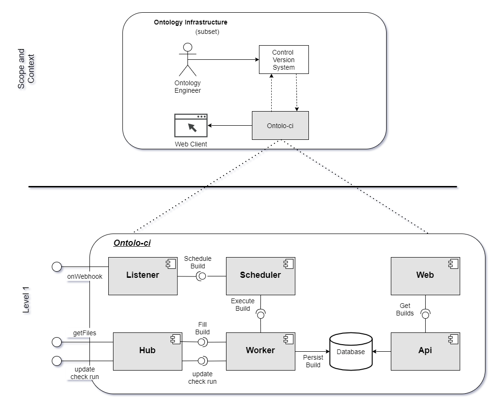
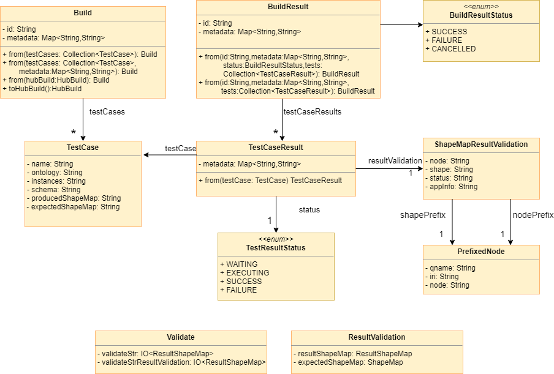

| Entregable     | Control de Versiones sobre ontologías OWL - Sistema de integración continua                           |
| -------------- | ------------------------------------------------------------ |
| Fecha          | 03/03/2021                                               |
| Proyecto       | [ASIO](https://www.um.es/web/hercules/proyectos/asio) (Arquitectura Semántica e Infraestructura Ontológica) en el marco de la iniciativa [Hércules](https://www.um.es/web/hercules/) para la Semántica de Datos de Investigación de Universidades que forma parte de [CRUE-TIC](https://tic.crue.org/hercules/) |
| Módulo         | Infraestructura Ontológica                                   |
| Tipo           | Método y Software                                        |
| Objetivo       | Este documento consiste en la especificación del sistema de sincronización continua de ontologías. |
| Estado         | **100%**  |
| Próximos pasos ||
|Repositorio de Software Asociado|https://github.com/HerculesCRUE/ontolo-ci |<!-- slide -->


# Módulo de Integración continua de ontologías 

## Introducción y Metas 
Este documento incluye la documentación arquitectónica para el módulo de integración continua de ontologías, en adelante llamado ontolo-ci, que forma parte de la infraestructura ontológica del Proyecto Hércules.

La estructura de este documento sigue la plantilla  [arc42](https://arc42.org/) para la documentación de arquitecturas de software y sistemas.

### Resumen de Requisitos
El objetivo general de ontolo-ci es realizar una validación continua de las ontologías contenidas en un sistema de control de versiones mediante un sistema de test basado en [Shape Expressions](https://shex.io/).

Puede encontrar un análisis más completo de los requisitos del sistema en la sección __Análisis de requisitos__.

### Metas de calidad
En esta sección enumeraremos los objetivos de máxima calidad para la arquitectura del sistema:

| Prioridad | Objetivo | Escenario |
| ---- | ----------- | -------- |
| 1 | Flexibilidad |  Aunque la implementación inicial del sistema funcionará a través del sistema de control de versiones GitHub, se deberá poder extender a otros sistemas de control de versiones de manera sencilla.|
| 1 | Tolerancia a fallos | En caso de que falle uno de los componentes que rodean al sistema de integración continua, el sistema debe poder seguir funcionando y mantener los demás objetivos de calidad siempre que sea posible. |

### Partes interesadas (Stakeholders)
 Role/Nombre   | Descripción                   | Expectativas              |
| ----------- | ------------------------- | ------------------------- |
| Expertos de dominio | Usuario que modifica el contenido de la ontología a través de la interfaz de usuario proporcionada por el servicio de publicación de ontologías. | Cuando se realiza un cambio a través de la interfaz de usuario, el contenido de las ontologías en el sistema de control de versiones debe ser coherente con estos cambios. |
| Ingeniero de ontologías | Usuario que modifica el contenido de la ontología directamente desde el sistema de control de versiones. | Cuando se modifica la ontología sobre el sistema de control de versiones, el sistema de integración continua debe realizar una ejecución automática de los test que validan la ontología |


## Restricciones de Arquitectura
| Restricción | Descripción                            |
|:---------:|----------------------------------------|
|     R1    | El sistema debe ser desarrollado bajo la licencia [GNU General Public License v3.0](https://www.gnu.org/licenses/gpl-3.0.html). |
|     R2    | El sistema debe ser independiente de la plataforma y debe poder ejecutarse en los principales sistemas operativos(Windows™, Linux, and Mac-OS™). |
|     R3    | El sistema debe poder ejecutarse desde la línea de comandos |
|     R4    | El sistema de versiones de control utilizado para almacenar las ontologías estará basado en git. |

## Alcance y Contexto del Sistema
Los distintos módulos software que componen un proyecto suelen utilizar sistemas de integración continua que permiten mantener el software continuamente testeado ejecutando los test de manera automática cada vez que se produzcan cambios sobre el software.

La integración continua de software dispone de un gran ecosistema de herramientas como [Travis](https://travis-ci.com/plans) o [Circle-ci](https://circleci.com/) que nos permiten llevar a cabo dicho propósito. Sin embargo, a la hora de testear ontologías, no existe ninguna herramienta que nos permita realizar un proceso de integración continua de la misma. Es entonces cuando surge la necesidad de crear un sistema que cumpla dicha necesidad.

Ontolo-ci es un sistema de integración continua de ontologías inspirado en [Travis](https://travis-ci.com/plans), que permite la ejecución de test para ontologías de manera automática sobre repositorios de GitHub. Las pruebas que realiza ontolo-ci sobre la ontología están basadas en test definidos mediante [Shape Expressions](https://shex.io/).

## Estrategia de solución
Para construir ontolo-ci y dar solución al problema planteado anteriormente es la creación de una API rest que sea capaz de:
 * Escuchar los cambios que se produzcan sobre el repositorio de la ontología y 
 * Llevar a cabo la ejecución de los test
 * Publicar los resultados obtenidos

Cada vez que se produce un cambio sobre el repositorio de la ontología, ontolo-ci recoge ese cambio y ejecuta todas las pruebas que se encuentren definidas. Una vez terminado este proceso, ontolo-ci notifica los resultados directamente sobre el propio repositorio, así como en su propia página web. En ambos lugares podemos observar los resultados de cada una de las pruebas.

## Vista de bloques
La vista de bloques muestra la descomposición estática del sistema en bloques de construcción (módulos, componentes, subsistemas, clases, interfaces, paquetes, bibliotecas, marcos, capas, particiones, niveles, funciones, macros, operaciones, estructuras de datos, ...) así como sus dependencias (relaciones, asociaciones, ...).

El siguiente diagrama muestra la descomposición estática de la construcción del sistema en bloques:


Ahora describiremos brevemente los elementos principales que componen esta vista.

### Sistema General de Caja Blanca

#### Cajas blancas
Los siguientes componentes han sido encontrados:
* listener: Este componente es el punto de entrada del subsistema que utilizarán otros sistemas externos. Para ello, ofrece una interfaz externa, denominada OnWebhook, que se encarga de recibir los datos sobre las actualizaciones de ontologías del sistema de control de versiones. Además, este componente es el encargado de crear objetos de tipo Build. Los objetos Build están presentes durante todo el ciclo de vida de ontolo-ci. Representan una ejecución de los tests sobre un estado concreto del repositorio de control de versiones. El listener es el encargado no solamente de crear estos objetos sino también de rellenarlos con la información que le llega del sistema de control de versiones.
* scheduler: Este componente es el encargado de decidir en qué momento se deben ejecutar las builds. De tal manera que si le llegan muchas builds sea capaz de gestionar el orden en que estas se han de ejecutar.
* worker: Este componente es el encargado de llevar a cabo la ejecución de los test una vez la build ha sido rellenada con los test oportunos.
* hub: El hub es el componente que se comunica con el sistema de control de versiones. Es el encargado de obtener los ficheros que se corresponden con la nueva build, así como de postear los resultados de los test en el sistema de control de versiones.
* api: El api expone un endpoint para ser consumido por la web. Devuelve los datos de las builds que ya ha finalizado.
* web: Este componente representa una página web donde se pueden ver los resultados de todas las builds que se han llevado a cabo.

### Nivel 2
En este nivel detallaremos cada uno de los bloques del sistema identificados anteriormente en el nivel 1.

#### Listener
* RepositoryRestListener: Define una interfaz para escuchar de los distintos repositorios de control de versiones.
* GitHubRestListener: Implementación de la interfaz RepositoryRestListener para el repositorio de control de versiones GitHub.


#### Scheduler
* Scheduler: Define un contrato con el módulo listener. Permite añadir builds a la lista de builds que se deben ejecutar.
* SchedulerImpl: Implementación concreta del scheduler


#### Api
* OntolociAPI: Define una interfaz para proveer las distintas builds ejecutadas en el sistema.
* SpringBootOntolociAPI: Implementa la interfaz OntolociAPI. Ofrece una API rest para ser consumida desde la web.


#### Worker
* Worker: Define un contrato para el scheduler.
* WorkerExecutor: Implementa la interfaz Worker. Es el encargado de comunicarse con el Hub para obtener los casos de prueba y para actualizar la información del repositorio una vez se ha llevado a cabo la validación, la cual se delega en el worker secuencial.
* WorkerSequential: Es el encargado de llevar a cabo la validación de los casos de prueba de una build.


* Build: Entidad que representa los casos de prueba a ejecutar de un repositorio concreto. Cada build tiene un identificador único, una colección de casos de prueba y una serie de metadatos. En los metadatos se encuentra toda la información relativa al repositorio donde se ha producido un cambio y donde se encuentran los casos de prueba.
* TestCase: Entidad que representa un caso de prueba. Cada caso de prueba está formado por: nombre, ontología, instancias, schema, shape map de entrada y shape map esperado.
* BuildResult: Entidad que representa los casos de prueba ejecutados de un repositorio concreto. Se encuentra formado por un identificador único, una colección de resultados de casos de prueba y una serie de metadatos. Entre los metadatos, además de los que contenía la build previamente, disponemos del tiempo de ejecución total de la build y shapeMaps resultantes y esperados. Por último, dispone de un estado que representa el estado de ejecución en el que se encuentra.
* BuildResultStatus: Enumerado que define los distintos estados que puede atravesar una BuildResult.
* TestCaseResult: Entidad que representa el resultado de un caso de prueba tras su validación. Dispone de una serie de metadatos donde se almacenan los tiempos de ejecución. Posee un estado que representa el estado de ejecución en el que se encuentra.
* TestCaseResultStatus: Enumerado que define los distintos estados que puede atravesar una TestCaseResult.
* ShapeMapResultValidation: Representación simplificada de una validación entre un nodo y una shape a modo de ShapeMap. Contiene el nodo, la shape, el estado (conformant o nonconformant) e información de la validación.
* PrefixNode: Entidad para representar un nodo prefijado.
* Validate: Realiza la validación de datos en rdf mediante Shape Expressions.
* ResultValidation: Objeto resultante de la validación realizada en la clase Validate. Contiene un shape map resultante y uno esperado.



#### Hub
* Hub: Define un contrato para el worker.
* HubImplementation: Implementa las operaciones definidas en la interfaz Hub. Recibe un objeto RepositoryProvider y delega en él las llamadas a los sistemas de control de versiones.
* RepositoryProvider: Define una interfaz para cada una de las implementaciones concretas de sistemas de control de versiones, como por ejemplo GitHub.
* GitHubRepositoryProvider: Implementa la interfaz RepositoryProvider. Se encarga de realizar la comunicación entre el Hub y GitHub.
* HubBuild: Representa una build (definida anteriormente) adaptada al dominio del Hub.
* HubTestCase: Representa un caso de prueba (definido anteriormente) adaptada al dominio del Hub.
* Manifest: Entidad que representa el objeto manifest.json en el que se definen los casos de prueba.
* ManifestEntry: Entidad que representa cada uno de los casos de prueba definidos dentro del manifest.json.
* RepositoryConfiguration: Representa el fichero oci.yml donde se establece la configuración del repositorio que desee usar ontolo-ci.


## Vista en tiempo de ejecución
En esta sección mostraremos un ejemplo de la vista del sistema en tiempo de ejecución, donde escucharemos los cambios de un repositorio de GitHub y se realizará la validación de los casos de prueba oportunos.
### Modificación de la ontología en el repositorio de GitHub
El siguiente diagrama ilustra la secuencia de eventos que ocurren cuando se produce un cambio sobre la ontología de un repositorio de GitHub que use ontolo-ci.


## Vista de despliegue
La siguiente imagen describe la vista de despliegue del sistema. Se han identificado los siguientes elementos:
* Public Ontology Repo: Representan los repositorios de GitHub que contienen las ontologías y los test y que se encuentran conectados a GitHub mediante el sistema de WebHooks de GitHub.
* Ontolo-ci: Este sistema será desplegado mediante docker. Por una parte, dispondrá de una API rest escuchando en el puerto 8090 y por otro lado dispondrá de un cliente web en el puerto 8080.


## Conceptos técnicos y transversales
En esta sección especificaremos algunos de los conceptos técnicos del proyecto.

### Tecnologías usadas
Las tecnologías utilizadas en el desarrollo del sistema se enuncian a continuación:

#### Java
Java es un lenguaje de programación y una plataforma informática comercializada por primera vez en 1995 por Sun Microsystems. Java es rápido, seguro, fiable y orientado a objetos. Además, dispone de una gran comunidad y librerías. 

Uno de los motivos principales por el que se decidió usar java es debido a la existencia de un validador de Shape Expressions escrito en Scala y totalmente compatible con Java.
#### Springboot
Spring es un framework para el desarrollo de aplicaciones web y contenedor de inversión de control, de código abierto para la plataforma Java
Spring Boot permite compilar nuestras aplicaciones Web como un archivo . jar que podemos ejecutar como una aplicación Java normal (como alternativa a un archivo . war , que desplegaríamos en un servidor de aplicaciones como Tomcat).

Springboot es una de los frameworks más utilizados actualmente para la construcción de API REST en java. Es por eso que hemos decidido utilizarlo en el proyecto.


## Decisiones de Diseño
En esta sección enumeraremos algunas de las decisiones de diseño tomadas durante la implementación del sistema.

### Patrón Adapter: Cambiar la implementación del Sistema de control de versiones
Uno de los objetivos iniciales era la flexibilidad, de manera que fuese posible extender de manera sencilla la implementación del módulo que se comunica con los sistemas de control de versiones (el hub) para abarcar nuevos sistemas.
Una de las posibles soluciones es enviarle al Hub el tipo de repositorio con el que nos vamos a comunicar y mediante una serie de ifs anidados comprobar de que tipo se trata:

```java
 public HubImplementation(String repositoryType) {

       if(repositoryType.equals("GITHUB")){
         this.repositoryProvider = new GitHubRepositoryProvider();
       }else if(repositoryType.equals("GITLAB")){
        this.repositoryProvider = new GitLabRepositoryProvider();
       }
       ...

    }
```
Sin embargo esta solución es bastante precaria, de modo que se decidió por definir una interfaz común a la que deberían adaptarse cada uno de los sistemas de control de versiones que quisiéramos utilizar:

```java
/**
 * This interface sets the contract for all the repository providers possible implementations
 * @author Pablo Menéndez
 */
public interface RepositoryProvider {

    /**
     * Gets a collection of test cases from a specific commit of a repository provider.
     *
     * @param owner                 of the repository
     * @param repo                  name of the repository
     * @param commit                sha of the commit
     *
     * @return test cases
     * @throws IOException
     */
    Collection<HubTestCase> getTestCases(
            final String owner,
            final String repo,
            final String commit
    ) throws Exception;


    /**
     * Creates a checkrun for a specific commit of a repository
     *
     * @param owner     of the repository
     * @param repo      name of the repository
     * @param commit    sha of the commit
     *
     * @return  id of the created checkrun
     * @throws IOException
     */
    String createCheckRun(
            final String owner,
            final String repo,
            final String commit) throws IOException;

    /**
     * Updates the checkrun status for a specific checkRunId of a repository
     *
     * @param checkRunId            id of the checkRun
     * @param owner                 of the repository
     * @param repo                  name of the repository
     * @param conclusion            new status of the checkrun
     * @param output                message
     *
     * @return  info of the updated checkrun
     * @throws IOException
     */
    String updateCheckRun(
            final String checkRunId,
            final String owner,
            final String repo,
            final String conclusion,
            final String output) throws IOException;
}
```
De tal forma que ahora la implementación del Hub quedaría de la siguiente forma:

```java
 public HubImplementation(RepositoryProvider repositoryProvider) {
      this.repositoryProvider = repositoryProvider;
    }
```

## Riesgos y deuda técnica
En esta sección describiremos algunos de los riesgos asociados a este sistema y las soluciones que se han propuesto hasta la fecha.

Uno de los riesgos que presenta el sistema es el hecho de que cambie el API de los sistemas de control de versiones, de tal manera que las llamadas que se realizan desde ontolo-ci para comunicarse con ellos cambien y el sistema deje de funcionar. La solución es sencilla, sólo habría que reemplazar las llamadas por las nuevas, pero es un riesgo a tener en cuenta ya que el sistema dejaría de funcionar hasta que se solventase el problema.

Otro aspecto muy importante a tener en cuenta es la persistencia de datos del sistema. Ontolo-ci está pensado para trabajar con bases de datos (generalmente documentales) que se encarguen de llevar a cabo esta labor. Sin embargo, por defecto, ya que no se trata de un sistema crítico y una ejecución no depende de la anterior, ofrece una base de datos cargada en memoria. En caso de querer trabajar con otra base de datos, ontolo-ci permite la extensión de manera sencilla.


## Tests
Los test que se han llevado a cabo han sido principalmente test unitarios. No se han llevado a cabo test de interfaces de usuario por disponer el sistema de una interfaz muy sencilla y fácilmente probable de manera no automática. A continuación, se muestra una tabla con el número de test realizados por módulo:

| Módulo      | Número de tests       |
|:------------|:---------------------:|
| Listener  | 4  |
| Hub  | 7  |
| Worker  | 13  |
| API  | 4  |
| Persistence  | 4  |

## Análisis de requisistos

| Código        | Descripción          |
|:-----------:|:---------------------|
| R1         | El sistema realizará la validación de los casos de prueba ante un evento de cambios en el repositorio de la ontología |
| R2         | El sistema escuchará eventos de tipo push |
| R3         | El sistema escuchará eventos de tipo pull request |
| R4         | El sistema notificará al usuario del estado en que se encuentre la ejecución de los casos de prueba |
| R5         | El sistema notificará de los resultados de la ejecución de los test al repositorio de la ontología |
| R6         | El sistema publicará los resultados de la ejecución de los test en su propia web |


## Anexos
En las siguientes secciones proporcionaremos varios documentos que brindan información adicional sobre el despliegue y uso de ontolo-ci.

### A: Despliegue de una instancia de ontolo-ci
Antes de desplegar nuestra propia instancia de ontolo-ci es necesario disponer de una GitHub App asociada a nuestra instancia.
Las [GitHub apps](https://docs.github.com/es/developers/apps/about-apps#:~:text=Las%20apps%20en%20GitHub%20te,vender%20apps%20en%20Mercado%20GitHub.&text=El%20usuario%20debe%20tener%20permisos,archivo%20de%20flujo%20de%20trabajo.) son la forma oficial y recomendada de integrar aplicaciones con GitHub, ya que ofrecen permisos mucho más granulares para acceder a los datos y para comunicarse con los repositorios.
Una vez tengamos nuestra GitHub App creada, podremos usar hacer uso de nuestra instancia de ontolo-ci en cualquier repositorio de GitHub de un usuario/organización que haya instalado nuestra GitHub App previamente.

#### Creación de una GitHub App
En primer lugar nos dirigimos a los ajustes de desarrollador de nuestra cuenta de GitHub https://github.com/settings/apps. 


A continuación, pulsamos en el botón de crear una nueva GitHub App y se nos abrirá una ventana con un formulario. Los campos del formulario que necesitamos rellenar obligatoriamente son los siguientes:

| Campo        | Descripción          |
|:-----------:|:---------------------|
| Nombre de la app        | Establecemos el nombre de nuestra GitHub App |
| URL de la página principal     | Aquí podemos poner la que queramos, pero es obligatorio poner una. Podemos poner la pública por defecto https://github.com/apps/<NOMBRE_DE_LA_GITHUB_APP> |
| CallBack URL | https://github.com/apps/<NOMBRE_DE_LA_GITHUB_APP>/installations/new |
| Webhook      | En el apartado de Webhook lo desactivamos desmarcando el check que viene por defecto|
| Permisos de repositorios      | **MUY IMPORTANTE:** Dar permiso de lectura y escritura para la opción Checks |

A continuación, le damos a crear y se nos mostrará una pantalla como la siguiente con la GitHub App creada. Podemos guardar los valores del ID y del Client ID ya que nos harán falta más adelante para el despliegue (pueden consultarse siempre que se quiera https://github.com/settings/apps).


Por último, es necesario generar una clave privada. Para ello bajamos al apartado Private Keys y generamos una nueva.


Es aconsejable guardar la clave privada dentro del directorio del proyecto, especialmente si la instancia va a ser desplegada con docker, ya que tiene que ser accesible desde dentro del contenedor.

#### Convertir clave privada a pkcs8 con OpenSSL
Ontolo-ci trabaja con claves privadas en formato pkcs8, sin embargo, las claves de nuestras GitHub Apps no se encuentran en este formato, por lo que es necesario transformarlas. Una manera sencilla es mediante la herramienta gratuita [OpenSSL](https://www.openssl.org/). En caso de estar en windows podemos descargarlo de https://slproweb.com/products/Win32OpenSSL.html.

Una vez tengamos OpenSSL en nuestro equipo podemos transformar nuestra clave privada con el siguiente comando:
```
openssl pkcs8 -topk8 -in <ruta-github-app.key> -out github-app-pkcs8.key –nocrypt
```

#### Despliegue por línea de comandos
Para desplegar ontolo-ci por línea de comandos es necesario tener instalado:
* [Java](https://www.java.com/es/)
* [Maven](https://maven.apache.org/)
* [Node.js](https://nodejs.org/en/)

Además, debemos tener el código de ontolo-ci descargado, podemos clonar el repositorio o descargar el código fuente directamente:
```
git clone https://github.com/weso/ontolo-ci.git
```
##### Variables de entorno
Para realizar el despliegue por línea de comandos es necesario configurar tres variables de entorno previamente:

| Variable de entorno        | Valor   |
|:-----------:|:---------------------|
| ONTOLOCI_GITHUB_APP_ID        |  Establecer el valor del ID de nuestra GitHub App|
| ONTOLOCI_GITHUB_KEY_PATH        | Establecer la ruta al fichero que contiene la clave privada (en formato pkcs8) de nuestra GitHub App  |
| REACT_APP_ONTOLOCI_CLIENT_ID        |   Establecer el valor del CLIENT_ID de nuestra GitHub App   |

##### Despliegue Backend
Una vez configuradas las variables de entorno podemos desplegar el backend situándonos en el directorio ontolo-ci y ejecutando el comando:
```
mvn spring-boot:run
```
El endpoint del listener se encontrará en disponible en http://localhost:8090

##### Despliegue Frontend
Para desplegar el frontend deberemos situarnos en el directorio ontolo-ci-web e instalar las dependencias necesarias mediante el comando:
```
npm i
```
A continuación, podremos desplegarlo mediante el comando:
```
npm start
```
La web se encontrará disponible en http://localhost:3000

#### Despliegue con Docker
Para desplegar ontolo-ci mediante docker es necesario tener instalado:
* [Docker](https://www.docker.com/) 
* [Docker Compose](https://docs.docker.com/compose/)

Además, debemos tener el código de ontolo-ci descargado, podemos clonar el repositorio o descargar el código fuente directamente:
```
git clone https://github.com/weso/ontolo-ci.git
```
##### Configurar docker-compose.yml
El docker-compose.yml se encuentra en el directorio docker/ dentro de ontolo-ci, y es necesario configurar las variables definidas en 
[Variables de entorno](#Variables-de-entorno)
##### Despliegue
Para desplegar el entorno únicamente es necesario tener la máquina virtual de docker arrancada, situarse en el directorio docker/ dentro de ontolo-ci, y ejecutar los comandos:
```
docker-compose build
```
```
docker-compose up -d
```
Una vez desplegado el endpoint del listener estará expuesto en  http://localhost:8090 y la web del frontend en  http://localhost:8080

### B: Integración de ontolo-ci con un repositorio de GitHub
#### Instalación GitHub App para usuarios/organizaciones
Para comenzar a usar nuestra instancia de ontolo-ci en primer lugar deberemos instalar la GitHub App, que hemos creado, en nuestro usuario/organización de GitHub. Para ello, si tenemos desplegado ontolo-ci podemos ir a la web y pulsar en el apartado Get Started del menú superior, que nos llevará directamente a la página de instalación. Podemos especificar el repositorio concreto donde queramos utilizar ontolo-ci o todos los repositorios.
#### Configuración .oci.yml
El repositorio en el que integremos ontolo-ci debe disponer de un fichero llamado .oci.yml sobre la raíz del repositorio. Este fichero debe tener el siguiente aspecto:
```
manifestPath: manifest.json
ontologyFolder: src
testFolder: test
```
En este fichero debemos aparecer reflejados los siguientes campos:

| Campo        | Descripción          |
|:-----------:|:---------------------|
| manifestPath | Ruta donde se encuentre el manifest.json en el repositorio (se definirá más adelante su contenido) |
| ontologyFolder | Ruta al directorio de la ontología |
| testFolder | Ruta al directorio de los tests |

#### Creación del manifest.json
El manifest.json es el fichero donde se definen los distintos casos de prueba. Tiene el siguiente aspecto:
```
[
 {
    "test_name": "test that a project instance has all needed attributes",
    "ontology": "asio-core.ttl",
    "data": "asio-individuals.ttl",
    "schema": "project.s",
    "in_shape_map": "project_in.m",
    "out_shape_map": "project_out.m"
  },
  {
    "test_name": "test that a researcher instance has all needed attributes",
    "ontology": "asio-core.ttl",
    "data": "asio-individuals.ttl",
    "schema": "researcher.s",
    "in_shape_map": "researcher_in.m",
    "out_shape_map": "researcher_out.m"
  }
]
```
Se trata de un json que contiene una lista de objetos donde cada objeto especifica un caso de prueba distinto. Los campos que posee un caso de prueba son los siguientes: (todos son obligatorios)

| Campo        | Descripción          |
|:-----------:|:---------------------|
| test_name | Nombre del caso de prueba |
| ontology | Ruta relativa a la ontología dentro del directorio de la ontología especificado en el campo ontologyFolder del .oci.yml |
| data | Ruta relativa al fichero que contiene las instancias de prueba ( en formato ttl) dentro del directorio de los test especificado en el campo testFolder del .oci.yml |
| schema | Ruta relativa al fichero de schemas, donde se definen las Shape Expressions, dentro del directorio de los test especificado en el campo testFolder del .oci.yml |
| in_shape_map | Ruta relativa al shape map de entrada dentro del directorio de los test especificado en el campo testFolder del .oci.yml |
| out_shape_map | Ruta relativa al shape map esperado dentro del directorio de los test especificado en el campo testFolder del .oci.yml |

#### Creación del WebHook
Por último, es necesario configurar un WebHook dentro de nuestro repositorio. Los Webhooks son la manera que tenemos de vincular nuestros repositorios con nuestras aplicaciones web. De tal manera que cuando se produce un evento sobre nuestro repositorio se notifica a nuestro WebHook y éste recibe la solicitud. En nuestro caso, vamos a configurar un Webhook en nuestro repositorio para que se comunique con ontolo-ci. Para ello vamos al apartado de WebHooks dentro de los ajustes del repositorio y pulsamos en el botón añadir WebHook:


La configuración es la siguiente:
| Campo        | Descripción          |
|:-----------:|:---------------------|
| Payload URL | URL donde se encuentra nuestra instancia de ontolo-ci en el puerto 8090 (http://example.com:8090) **MUY IMPORTANTE:**Es necesario que está IP sea accesible desde el exterior|
| Content type | Seleccionamos la opción application/json |
| Secret | Dejar en blanco |
| Eventos | Enviar todo |


Llegados a este punto, y con nuestra instancia de ontolo-ci desplegada, nuestro repositorio estará integrado con ontolo-ci, de tal manera que cada vez que realicemos un push o una pull request sobre el repositorio podremos ver como se crean y actualizan los checkruns, así como todas las builds que se han llevado a cabo en la web. 


El repositorio [ontolo-ci-example](https://github.com/weso/ontolo-ci-example) representa un ejemplo de una configuración básica para empezar a usar ontolo-ci.

## Glosario
| Término        | Definición          |
|:-----------:|:---------------------|
| WebHook | Un webhook, en desarrollo web, es un método de alteración del funcionamiento de una página o aplicación web, con callbacks personalizados. Estos se pueden mantener, modificar y gestionar por terceros; desarrolladores que no tienen por qué estar afiliados a la web o aplicación.|
| PKCS8 | Sintaxis estándar para almacenar información de clave privada |

